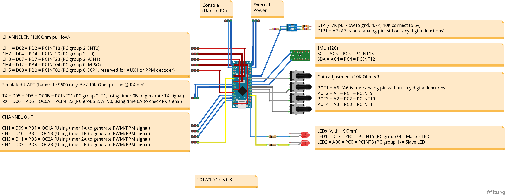

# OneRCFW
An Arduino/AVR based flight controller for RC fixed wing.  
  
  

    - 5 input channels (Throttle, Ailerons, Elevator, Rudder, flight mode)  
    - 4 output channels (0.5 us resolution PWM/PPM signal generator).  
    - Airplane NED attitude tracking function (with 6 DOF sensor, 200 Hz attitude update rate).
    - Airplane auto level (roll and pitch) control function.  
    - Airplane heading lock control function.  
    - Airplane flight mode control function (manual mode, auto level mode and GPS mode).  
    - RC output mixer function (for normal airplane, delta wing and V tail).  
    - 6 DOF sensor calibration function.  
    - Radio control stick position calibration function.    
    - Airplane failsafe function.  
    - Airplane configuration save/reload/reset function.  
    - Airplane runtime status monitoring function.  
  
  

  
  
Details:
---------------------
Flight controller source code: [OneRCFW](https://github.com/rollingbug/OneRCFW/tree/master/OneRCFW)  
Flight controller schematic and PCB layout: [OneRCSchematic_v1](https://github.com/rollingbug/OneRCFW/tree/master/OneRCSchematic/OneRCSchematic_v1)  
Flight controller test video: [20171029 FC test in very windy (12.5m/s) day.](https://www.youtube.com/watch?v=OjTpQ1Ft-OE)  
GUI monitoring tool: [OneRCGUI](https://github.com/rollingbug/OneRCFW/tree/master/OneRCGUI)  
Design documents: [OneRCDesignDoc](https://github.com/rollingbug/OneRCFW/tree/master/OneRCDesignDoc)   
  
  
Build and Installation:
---------------------
1. Prepare Arduino 1.6.9 IDE.
2. Click the **OneRCAirplane.ino** to launch Arduino IDE. 
3. Change board type setting to "Arduino Nano" or "Micro" and correct UART port setting.
4. Build and upload the firmware to Arduino or customized PCB.
5. Connect the Radio receiver to flight controller.
6. Check the channel output signal and the status of on board LEDs.

